# 🌐 Netpractice 🌐

## Overview

Netpractice is a networking project from the 42 curriculum focused on understanding **IP addressing and routing fundamentals**. The project consists of solving a set of interactive exercises where the user must correctly configure network devices so that communication between hosts is possible.

The main goal is to develop a solid understanding of how devices communicate at **OSI layers 1, 2, and 3**, with emphasis on **IPv4 addressing**, **subnet masks**, **routing tables**, **default gateways**, **routers**, and **switches**.

## Table of Contents
- [Overview](#overview)
- [Requirements ⚙️](#requirements-️)
- [Installation 🔧](#installation-️)
- [Usage 📖](#usage-)
- [Resources 📚](#resources)
  - [What is a Network?](#what-is-a-network)
  - [Types of Networks](#types-of-networks)
  - [Communication Protocols](#communication-protocols)
  - [OSI Model](#osi-model)
  - [TCP/IP Protocol](#tcpip-protocol)
  - [IP Addressing](#ip-addressing)
  - [Routing](#routing)
  - [Reserved IP Address Ranges](#reserved-ip-address-ranges)
- [Levels](#levels)
- [Author 👥](#author)


## Requirements ⚙️

* Linux or macOS
* A modern web browser (Firefox, Chromium, Chrome, etc.)
* `tar` utility


## Installation 🔧

To get started, first clone the repository and navigate to the project directory on your computer:

```bash
git clone https://github.com/alcarril/Net.Practice.git <name-of-your-choice>
cd <name-of-your-choice>
```

Extract the project archive provided in the repository.

* From the CLI:

	```bash
	tar -xvf netpractice.tgz
	```

* From the graphical environment: Double-click the `.tgz` file to extract it.


## Usage 📖

After extracting the files, open the interface using a web browser.

* **From the CLI:**

	```bash
	firefox index.html
	```
	*(Any modern browser can be used.)*

* **From the graphical environment:** Right-click on `index.html` → **Open with** → select your browser.

### Modes of Operation
Once opened, the Netpractice interface will load. There are two modes available:

#### Training Mode
Training mode allows practice using a **personalized configuration** associated with the user login.

* Contains **10 levels** with increasing difficulty.
* Each level presents a **network topology diagram** with missing fields.
* The user must configure:

  * IPv4 addresses
  * Subnet masks
  * Default gateways
  * Routing tables

The objective is to ensure correct communication between all devices according to the given topology.

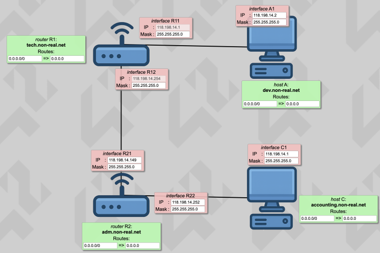
<br>

After completing a level:

* **Check again** validates the configuration.
* **Get my config** exports the configuration as a **JSON file**.
* Successfully validating a level unlocks the **next level**.


At the bottom of the interface, **packet flow logs** display how IP packets traverse the network. These logs are essential for debugging issues such as:

* Incorrect or missing default gateways
* Invalid IP addresses
* Wrong subnet masks

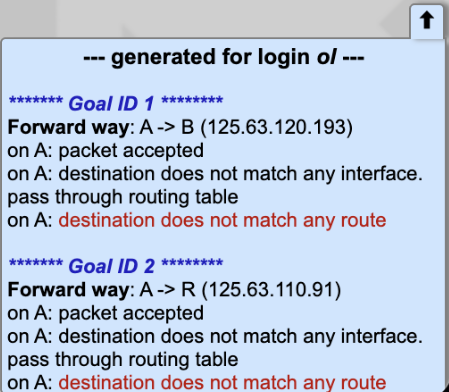

#### Evaluation Mode

Evaluation mode generates a **randomized network configuration**, intended for assessments.

* Exercises are selected randomly.
* Focuses mainly on **levels 6 and above**, where routing complexity increases.


## Resources and Concepts 📚

### What is a Network?

A network is a set of interconnected devices that can communicate and share resources and information (data packets) with each other (data transfer). It consists of a physical part (hardware such as cables, routers, and servers) and a logical part (protocols that dictate how data is transmitted).

#### Private Networks
- Private networks are restricted to specific users or organizations and are not accessible to the general public.
- Commonly used in homes, offices, or enterprises to share resources like printers, servers, and databases.
- More secure because they are isolated from public access and often include additional security measures such as firewalls and encryption.
- **Examples:** Home Wi-Fi networks and corporate intranets.

#### Public Networks
- Public networks are open to anyone and are used for global communication and information sharing.
- Commonly used to access the Internet or public Wi-Fi in places like cafes, airports, or libraries.
- Less secure due to their open nature, so additional protections like VPNs or encryption are often necessary.
- **Examples:** The Internet and free Wi-Fi hotspots.

### What is a communication Protocol ?

Protocols are, in fact, the set of standardized rules that define how data should be formatted, transmitted, received, and interpreted between devices. Without them, communication would be chaotic.

### OSI Model

The OSI (Open Systems Interconnection) model is a conceptual framework used to understand and standardize how different networking protocols interact. It divides the communication process into seven distinct layers, each with specific functions and responsibilities. These layers are:

1. **Physical Layer:** Handles the transmission of raw data bits over a physical medium, such as cables or wireless signals.
2. **Data Link Layer:** Ensures reliable data transfer between devices on the same network, managing error detection and correction.
3. **Network Layer:** Responsible for routing and forwarding data packets between different networks.
4. **Transport Layer:** Provides end-to-end communication control, ensuring data is delivered reliably and in the correct order.
5. **Session Layer:** Manages and controls the connections between devices, including establishing, maintaining, and terminating sessions.
6. **Presentation Layer:** Translates data between the application layer and the network, handling encryption, compression, and data formatting.
7. **Application Layer:** Provides network services directly to end-user applications, such as web browsers and email clients.

The OSI model helps developers and engineers design and troubleshoot network systems by providing a clear structure for understanding how data flows through a network.

### TCP/IP Protocol

The Internet Protocol (IP) is responsible for logical addressing and routing. It uses IP addresses, which are logical identifiers assigned to devices within a network. Depending on whether the network is private or public, IP addresses can be private or public, and this is where the Network Address Translation (NAT) mechanism comes into play, allowing private addresses to be translated into public ones for communication over the Internet.

In addition to addressing, IP is also responsible for routing packets across networks. When a computer sends data to another computer, the data is first transmitted over a local network, such as Ethernet or Wi-Fi, and then reaches a router. Routers forward packets based on their routing tables, sending them to the next hop router until the packets reach the destination network.

IP follows a best-effort delivery model, meaning it attempts to deliver packets using the most efficient available path, but it does not guarantee delivery, order, or integrity.

On the other hand, Transmission Control Protocol (TCP) provides reliable communication. TCP ensures that all transmitted data is correctly received by segmenting the data stream, tracking segments with sequence numbers, and confirming reception through acknowledgements (ACKs). If some segments are lost during transmission, TCP detects the loss and requests retransmission from the sender, ensuring complete and accurate data delivery.

### IP Addressing

An IP address is a unique identifier that allows devices to communicate on a network. Depending on the number of bits, it can be IPv4 (32 bits) or IPv6 (128 bits). For example, a typical IPv4 address is:

```bash
192.168.1.10 → 11000000.10101000.00000001.00001010
```

A subnet mask defines which part of the IP address corresponds to the network and which part corresponds to the host. For example, the mask in binary is:

```bash
255.255.255.0 → 11111111.11111111.11111111.00000000
```

> **Note:** Subnet masks can be written in dotted decimal notation (255.255.255.0) or in CIDR notation (/24).

To obtain the network address, a bitwise AND operation is performed between the IP and the mask:

```
IP:      11000000.10101000.00000001.00001010  (192.168.1.10)
Mask:    11111111.11111111.11111111.00000000  (255.255.255.0)
---------------------------------------------------
Network: 11000000.10101000.00000001.00000000  → 192.168.1.0
```

The host addresses range from the first valid device to the broadcast address of the network:

- **Valid hosts:** 192.168.1.1 → 192.168.1.254
- **Broadcast:** 192.168.1.255


#### CIDR Subnet Mask Summary

| CIDR | Subnet Mask       | Wildcard Mask    | # of IP Addresses | # of Usable IP Addresses |
|------|-------------------|------------------|-------------------|--------------------------|
| /32  | 255.255.255.255   | 0.0.0.0          | 1                 | 1                        |
| /31  | 255.255.255.254   | 0.0.0.1          | 2                 | 2                        |
| /30  | 255.255.255.252   | 0.0.0.3          | 4                 | 2                        |
| /29  | 255.255.255.248   | 0.0.0.7          | 8                 | 6                        |
| /28  | 255.255.255.240   | 0.0.0.15         | 16                | 14                       |
| /27  | 255.255.255.224   | 0.0.0.31         | 32                | 30                       |
| /26  | 255.255.255.192   | 0.0.0.63         | 64                | 62                       |
| /25  | 255.255.255.128   | 0.0.0.127        | 128               | 126                      |
| /24  | 255.255.255.0     | 0.0.0.255        | 256               | 254                      |
| /23  | 255.255.254.0     | 0.0.1.255        | 512               | 510                      |
| /22  | 255.255.252.0     | 0.0.3.255        | 1,024             | 1,022                    |
| /21  | 255.255.248.0     | 0.0.7.255        | 2,048             | 2,046                    |
| /20  | 255.255.240.0     | 0.0.15.255       | 4,096             | 4,094                    |
| /19  | 255.255.224.0     | 0.0.31.255       | 8,192             | 8,190                    |
| /18  | 255.255.192.0     | 0.0.63.255       | 16,384            | 16,382                   |
| /17  | 255.255.128.0     | 0.0.127.255      | 32,768            | 32,766                   |
| /16  | 255.255.0.0       | 0.0.255.255      | 65,536            | 65,534                   |
| /15  | 255.254.0.0       | 0.1.255.255      | 131,072           | 131,070                  |
| /14  | 255.252.0.0       | 0.3.255.255      | 262,144           | 262,142                  |
| /13  | 255.248.0.0       | 0.7.255.255      | 524,288           | 524,286                  |
| /12  | 255.240.0.0       | 0.15.255.255     | 1,048,576         | 1,048,574                |
| /11  | 255.224.0.0       | 0.31.255.255     | 2,097,152         | 2,097,150                |
| /10  | 255.192.0.0       | 0.63.255.255     | 4,194,304         | 4,194,302                |
| /9   | 255.128.0.0       | 0.127.255.255    | 8,388,608         | 8,388,606                |
| /8   | 255.0.0.0         | 0.255.255.255    | 16,777,216        | 16,777,214               |
| /7   | 254.0.0.0         | 1.255.255.255    | 33,554,432        | 33,554,430               |
| /6   | 252.0.0.0         | 3.255.255.255    | 67,108,864        | 67,108,862               |
| /5   | 248.0.0.0         | 7.255.255.255    | 134,217,728       | 134,217,726              |
| /4   | 240.0.0.0         | 15.255.255.255   | 268,435,456       | 268,435,454              |
| /3   | 224.0.0.0         | 31.255.255.255   | 536,870,912       | 536,870,910              |
| /2   | 192.0.0.0         | 63.255.255.255   | 1,073,741,824     | 1,073,741,822            |
| /1   | 128.0.0.0         | 127.255.255.255  | 2,147,483,648     | 2,147,483,646            |
| /0   | 0.0.0.0           | 255.255.255.255  | 4,294,967,296     | 4,294,967,294            |

### Routing
Routing is responsible for connecting different networks and ensuring that packets reach their destination even if it is outside the source network. Both hosts and routers communicate through their network interfaces, which are physical or virtual connection points with their own network interface card (NIC) and MAC address, and can also have an assigned IP address.

#### LAN - LAN Communication
When a host sends a packet to a destination within the same network, the packet is delivered directly through a switch, which forwards the data using the MAC addresses of the devices' interfaces. It can also send by the router "integrated switch" if available or wifi access point.

##### What is a switch?
A switch is a networking device that operates at the Data Link Layer (Layer 2) of the OSI model. Its primary function is to connect multiple devices within a local area network (LAN) and facilitate communication between them by forwarding data packets based on their MAC addresses.

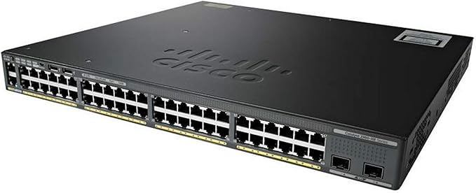


#### LAN - other Network Communication
When the destination is in a different network, the host sends the packet to its pre-configured default gateway, which is a router. Each router interface has its own MAC and IP address, and the router consults its routing table to determine the next hop, forwarding the packet either to another router on the WAN or to another LAN directly connected, until it reaches the final destination.

If the packet is going out to the Internet, the router may use NAT (Network Address Translation) to translate the host's private IP address into a public IP provided by the ISP, allowing the packet to be properly routed across the global network and reach its destination.

There are some IP addresses that are reserved for specific uses. Therefore, when assigning a IP Address inside of a network connected to the internet, you must pay attention to the list below:

| IP Address Range           | Reserved For                              |
|----------------------------|-------------------------------------------|
| 10.0.0.0 - 10.255.255.255  | Reserved for private IPs (Class A)        |
| 127.0.0.0 - 127.255.255.255| Reserved for loopback and internal testing|
| 172.16.0.0 - 172.31.255.255| Reserved for private IPs (Class B)        |
| 192.168.0.0 - 192.168.255.255| Reserved for private IPs (Class C)      |
| 224.0.0.0 – 239.255.255.255| Reserved for multicast                    |
| 240.0.0.0 – 255.255.255.255| Reserved for experimental, used for research |

##### What is a router?
A router is a networking device that operates at the Network Layer (Layer 3) of the OSI model. Its primary function is to connect multiple networks together and facilitate communication between them by forwarding data packets based on their IP addresses.

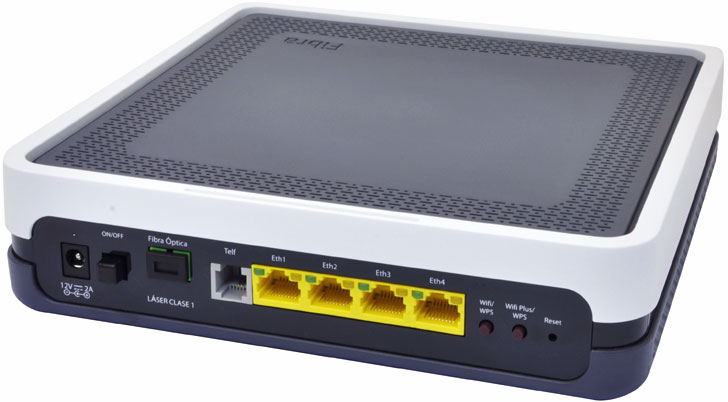

##### Routing table
A routing table is a data structure used by routers to determine the best path for forwarding data packets to their destination networks. It contains a list of network destinations, associated subnet masks, next hop addresses, and interface information. When a router receives a packet, it consults its routing table to find the most appropriate route based on the destination IP address, allowing it to efficiently forward the packet towards its final destination.

> <span style="color: orange;">In the project, the routing table is simplified to only include destination networks and their corresponding next hop addresses or interfaces.</span>

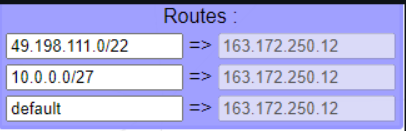


## Levels Description

<details>
<summary>Level 1</summary>

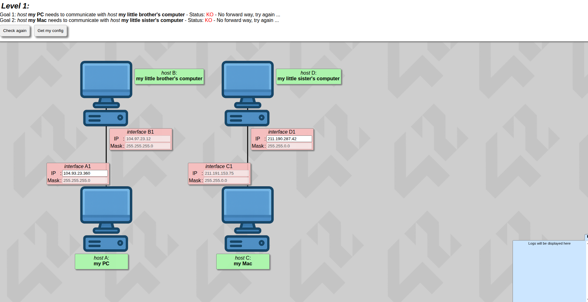  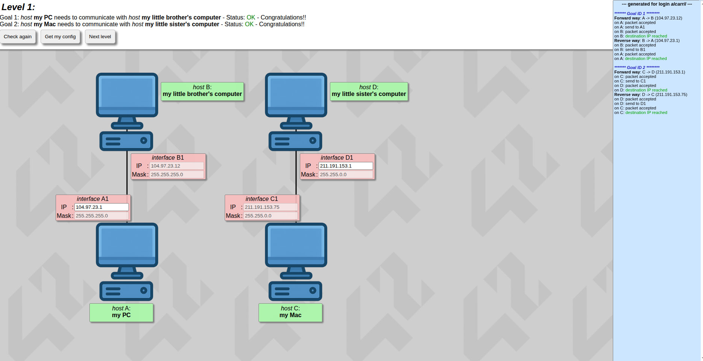

# Level 1 – Basic LAN IP Assignment

## LAN 1 – 2 hosts connected
- **Fixed interface:** 104.97.23.12/24  
- **Network:** 104.97.23.0/24 (LAN)  
- **Available host IPs:** 104.97.23.1 – 104.97.23.254  
- **Task:** Assign any available host IP to the configurable interface  
- **Note:** Both interfaces belong to the same Layer 3 LAN and can communicate directly

## LAN 2 – 2 hosts connected
- **Fixed interface:** 211.191.153.75/16  
- **Network:** 211.191.0.0/16 (LAN)  
- **Available host IPs:** 211.191.0.1 – 211.191.255.254  
- **Task:** Assign any available host IP to the configurable interface  
- **Note:** Both interfaces belong to the same Layer 3 LAN and can communicate directly

</details>

<details>
<summary>Level 2</summary>

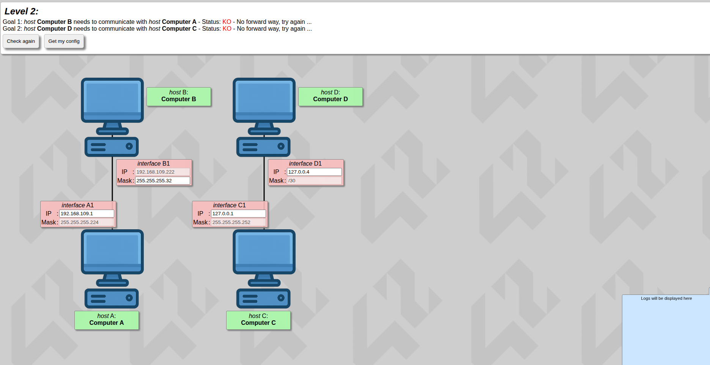  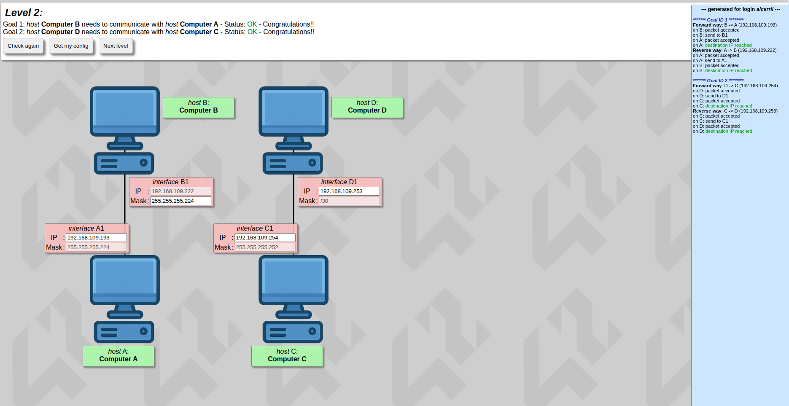

# Level 2 – LAN IP Address Configuration with Fixed and Configurable Interfaces

## LAN 1 – 2 hosts connected
- **Fixed interface:** 192.168.109.222/27  
- **Network:** 192.168.109.192/27 (LAN)  
- **Subnet mask:** 255.255.255.224 (/27)  
- **Available host IPs:** 192.168.109.193 – 192.168.109.222 (excluding fixed IP)  
- **Host addressing:** 4 bits available → 32 possible addresses per subnet  
- **Task:** Assign any available host IP to the configurable interface  
- **Note:** Both interfaces belong to the same Layer 3 LAN and can communicate directly

## LAN 2 – 2 hosts connected
- **Fixed interface:** 127.0.0.1/30  
- **Network:** 127.0.0.0/30 (LAN)  
- **Subnet mask:** 255.255.255.252 (/30)  
- **Available host IPs:** 127.0.0.1 – 127.0.0.2 (excluding loopback)  
- **Host addressing:** 2 bits available → 2 usable host IPs  
- **Task:** Assign a valid host IP to the configurable interface, avoiding loopback addresses  
- **Note:** Both interfaces belong to the same Layer 3 LAN and can communicate directly

</details>

<details>
<summary>Level 3</summary>

  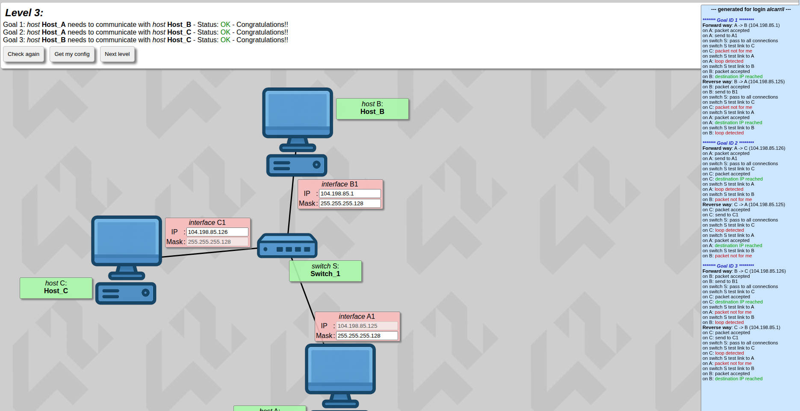

# Level 3 – LAN IP Address Configuration

## LAN 1 – 3 hosts connected through a switch
- **Network:** 104.198.85.0/25 (LAN)  
- **Subnet mask:** 255.255.255.128 (/25)  
- **Fixed interface IP:** 104.198.85.125  
- **Network address:** 104.198.85.0/25  
- **Broadcast address:** 104.198.85.127  
- **Usable host range:** 104.198.85.1 – 104.198.85.126  
- **Task:** Assign configurable interfaces any available IP within this range to remain in the same LAN  
- **Switch:** Operates at Layer 2 only, facilitating Ethernet frame forwarding; no IP configuration needed

</details>

<details>
<summary>Level 4</summary>

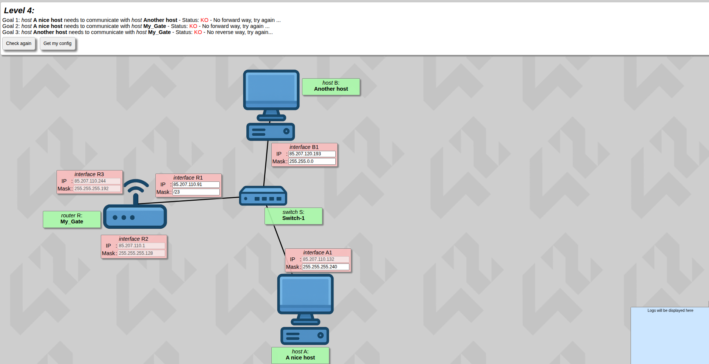  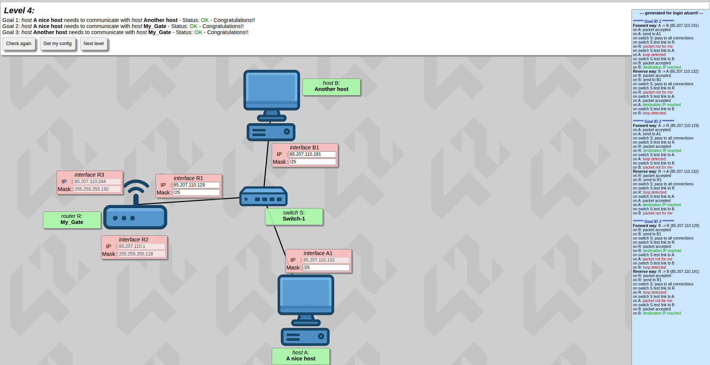

# Level 4 – LAN IP Address Configuration with Router

## Scenario
Two hosts connected through a switch to a router with 3 interfaces.

---

## R1 – Existing LAN interface
- **IP:** 85.207.110.244/26  
- **Subnet mask:** 255.255.255.192  
- **Network address:** 85.207.110.192/26  
- **Usable hosts:** 85.207.110.193 – 85.207.110.254  
- **Broadcast:** 85.207.110.255  
- **Total usable hosts:** 62  

---

## R2 – Existing LAN interface
- **IP:** 85.207.110.1/25  
- **Subnet mask:** 255.255.255.128  
- **Network address:** 85.207.110.0/25  
- **Usable hosts:** 85.207.110.1 – 85.207.110.127  
- **Broadcast:** 85.207.110.127  
- **Total usable hosts:** 126  

---

## R3 – Configurable LAN interface
- **Purpose:** Assign IPs to a new LAN without overlapping R1 or R2 subnets  
- **Subnet mask:** /26 (255.255.255.192)  
- **Network address:** 85.207.110.128/26  
- **Usable hosts:** 85.207.110.129 – 85.207.110.190  
- **Broadcast:** 85.207.110.191  
- **Example host IP:** 85.207.110.132  
- **Task:** Assign IP addresses to devices in the new LAN using this subnet  
- **Note:** All devices must share the same Layer 3 LAN and subnet mask (/26) for proper communication  
- **Switch:** Operates at Layer 2 only, forwarding Ethernet frames  

---

> **TIP:** When router interfaces have the same network portion in their IPs, they belong to the same subnet. Ensure the new LAN's subnet does not overlap with existing subnets.

</details>

<details>
<summary>Level 5</summary>

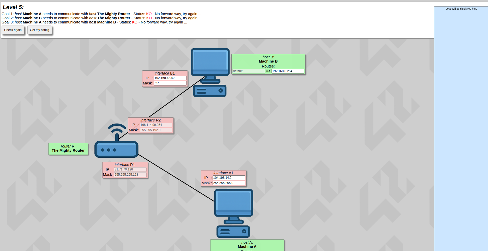  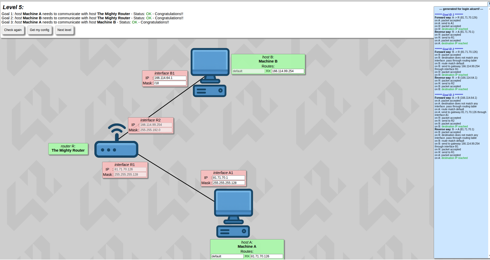

# Level 5 – LAN-to-LAN Communication via Router (Gateways)

## Scenario
Two separate LANs connected to the same router. Each LAN has one host. Routing uses the router interfaces as gateways.

---

## LAN 1 – Host A connected to Router interface RA
- **Router interface RA:** 166.114.199.254/20 (mask 255.255.240.0, network 166.114.192.0/20, LAN)  
- **Broadcast address:** 166.114.207.255  
- **Usable host range:** 166.114.192.1 – 166.114.207.254  
- **Total usable hosts:** 4094  
- **Host A configuration:**  
  - IP: any available host in the LAN (example 166.114.192.1)  
  - Subnet mask: 255.255.240.0  
  - Gateway: 166.114.199.254 (RA)

---

## LAN 2 – Host B connected to Router interface RB
- **Router interface RB:** 87.71.70.126/25 (mask 255.255.255.128, network 87.71.70.0/25, LAN)  
- **Broadcast address:** 87.71.70.127  
- **Usable host range:** 87.71.70.1 – 87.71.70.126  
- **Total usable hosts:** 126  
- **Host B configuration:**  
  - IP: any available host in the LAN (example 87.71.70.1)  
  - Subnet mask: 255.255.255.128  
  - Gateway: 87.71.70.126 (RB)

---

## Routing / Gateway Logic
- There is no communication with other devices in the same LAN, so **all traffic is sent to the gateway**.  
- Two configuration options:
  1. **Default route:** All traffic goes to the router interface.  
  2. **Specific route:** Traffic to the other host or its network is sent to the gateway.  
- **Option 2 is convenient** since each LAN has only one external host to reach.

</details>

<details>
<summary>Level 6</summary>

  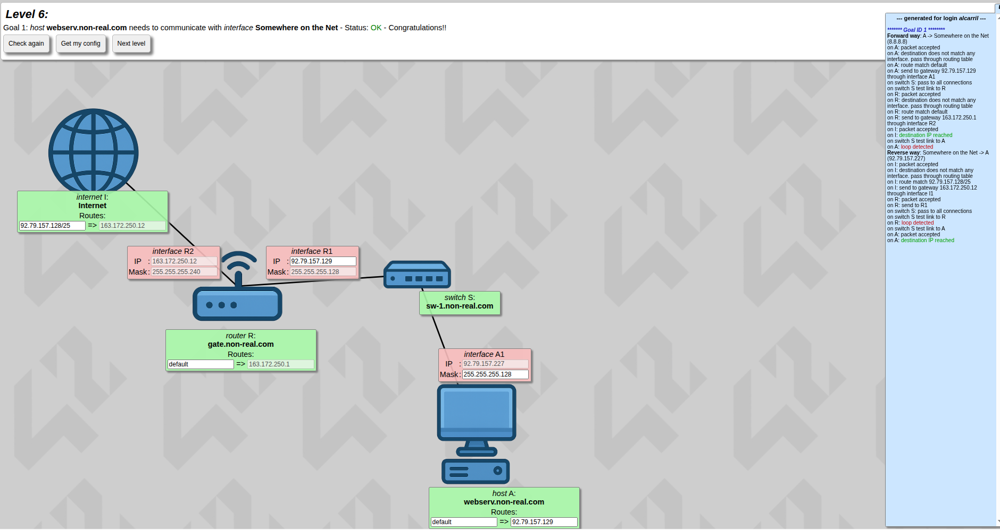

# Level 6 – LAN-to-Internet Communication via Router (9-point structure)

## Scenario
One LAN connects a router to a host through a switch, with Internet connected to the router.  
**Main task:** Route all traffic from Internet to LAN 1 via the router interface and set the **default route in Host 1** for all traffic outside its LAN.

---

## LAN 1 – Host 1 connected to Router interface RA through a switch
- **Router interface RA (LAN side):** 92.79.157.227/25  
- **Subnet mask:** 255.255.255.128  
- **Network address:** 92.79.157.128/25  
- **Broadcast address:** 92.79.157.255  
- **Usable host range:** 92.79.157.129 – 92.79.157.254  
- **Total usable hosts:** 126  
- **Gateway for Host 1:** 92.79.157.227 (RA interface)  
- **Host 1 IP:** Any available host in the LAN (example 92.79.157.129)  
- **Routing logic:** All traffic outside the LAN is sent to the gateway RA (default route in Host 1 routing table)

---

## Router – connecting LAN 1 to Internet
- **Router interface RA:** connected to LAN 1  
- **Router interface RB:** 163.172.250.12/28 (Internet side)  
- **Subnet mask RB:** 255.255.255.240  
- **Network address RB:** 163.172.250.0/28  
- **Broadcast address RB:** 163.172.250.15  
- **Usable host range RB:** 163.172.250.1 – 163.172.250.14  
- **Total usable hosts RB:** 14  
- **Task:** Forward all traffic not in LAN 1 via RB  
- **Routing logic:** Default route for all unknown traffic goes to RB (towards Internet)

---

## Internet – connected to Router RB
- **Internet connection to Router RB interface**  
- **Gateway:** Router RB interface (163.172.250.12)  
- **Routing table:** Directs all traffic destined to LAN 1 (92.79.157.128/25) through Router RB  
- **Purpose:** Ensure packets reach LAN 1 via RA  
- **Other traffic:** Follows normal Internet routing rules  
- **Host configuration:** No additional configuration required  
- **Main task:** Route traffic to LAN 1 via RB; default routing outside LAN 1 handled by RB interface

</details>

<details>
<summary>Level 7</summary>

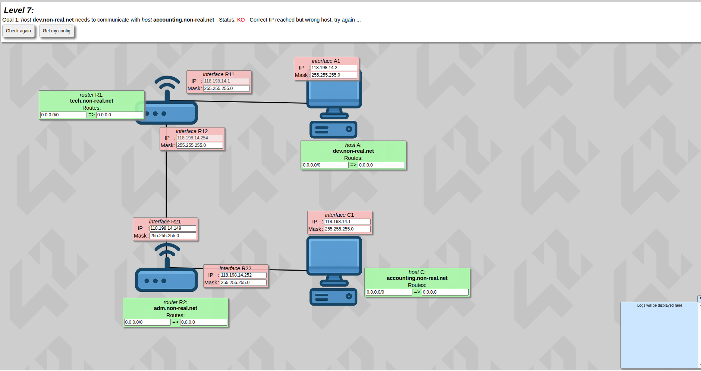  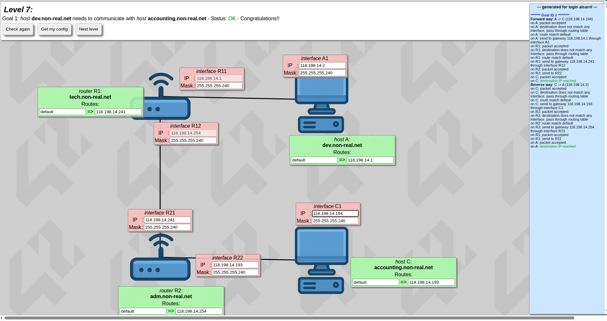

# Level 7 – Three Networks Connecting Two Hosts via Two Routers

**Scenario** – The main goal of this level is to configure subnets between LAN 1 (Host 1 ↔ Router 1) and WAN 1 (Router 1 ↔ Router 2) and ensure proper routing between routers. Each router has its own routing table. The key concept is that Router 1 must route traffic to Router 2 (next hop), and Router 2 must route traffic back to Router 1 for bidirectional communication. Host 1 and Host 2 must use their respective router interfaces as gateways to reach the other host.  

---

## Network Configuration Overview
**Main network:** 118.198.14.0/24 – this is the base network from which subnets will be derived.  
**Subnetting goal:**  
- LAN 1: connect Host 1 to Router 1  
- WAN 1: connect Router 1 to Router 2  
- LAN 3: connect Router 2 to Host 2 (can be a subnet of 118.198.14 or a new network)  

---

## LAN 1 – Host 1 to Router 1
**Router 1 interface (LAN side):** 118.198.14.1  
**Subnet mask:** 255.255.255.240 (/28) – supports 14 usable hosts (118.198.14.1 – 118.198.14.14)  
**Network address:** 118.198.14.0/28  
**Gateway (Host 1):** 118.198.14.1  
**Host 1 IP:** any available IP in subnet (example 118.198.14.2)  
**Routing logic:** all traffic outside LAN 1 is sent to Router 1 interface (default route) or via WAN 1 to reach Host 2  

---

## WAN 1 – Router 1 to Router 2
**Router 1 interface (WAN side):** 118.198.14.254  
**Router 2 interface (WAN side):** 118.198.14.253  
**Subnet mask:** 255.255.255.252 (/30) – 2 usable hosts  
**Network address:** 118.198.14.252/30  
**Task:** assign IPs to both router interfaces within this WAN subnet  
**Routing logic:** Router 1 default route → Router 2 (next hop), Router 2 default route → Router 1 (next hop)  

---

## LAN 3 – Router 2 to Host 2
**Router 2 interface (LAN side):** configurable IP (can be a subnet of 118.198.14 or a new network)  
**Subnet mask:** defined per network design  
**Gateway (Host 2):** Router 2 interface  
**Host 2 IP:** any available IP in subnet  
**Routing logic:** all traffic outside LAN 3 or destined to Host 1/network is sent to Router 2 interface (default route or via WAN 1)  

---

## Key Concepts
- Subnetting separates LAN 1 and WAN 1 to avoid IP overlap  
- WAN connecting routers uses a /30 subnet for two usable IPs  
- Hosts use router interfaces as default gateways  
- Routers forward unknown traffic via default route to the next router (next hop)  
- LAN 3 can be a new subnet or part of the main network 118.198.14  
</details>

<details>
<summary>Level 8</summary>

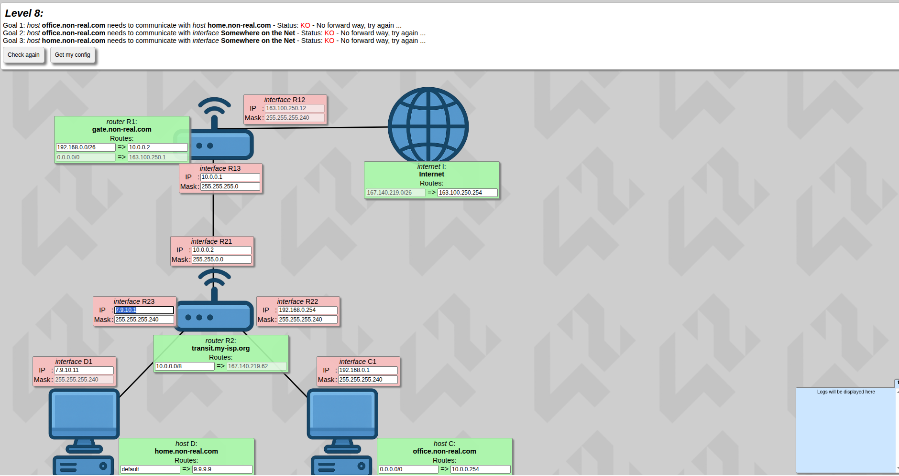  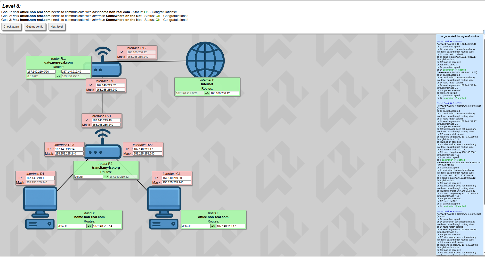

# Level 8 – Two LANs Connecting Hosts via Router 2 to Internet

**Scenario** – Two LANs, each with one host, connect to Router 2. Router 2 connects to Router 1 via a WAN, and Router 1 connects to Internet via another WAN. Hosts must communicate with each other and with Internet. Internet routing table specifies all traffic destined to 167.140.219.0/26 (64 usable IPs). Router 2 WAN interface connecting to Router 1 must share the same subnet as Router 1 WAN interface. Router 1 uses next hop 167.140.219.49 in its routing table for traffic destined to the subnet of Router 2 (the key concept of this level).

---

## Internet
**Destination network:** 167.140.219.0/26 (mask 255.255.255.192)  
**Usable host range:** 167.140.219.1 – 167.140.219.62  
**Routing logic:** all traffic destined to this network is sent via Router 1 WAN interface  

---

## Router 2 – Connecting Two LANs
**LAN 1 interface:** configurable IP within subnet < 64  
**LAN 2 interface:** configurable IP within subnet < 64, non-overlapping with LAN 1  
**WAN interface to Router 1:** part of the same subnet as Router 1 WAN (Next Hop 167.140.219.49)  
**Subnetting logic:** divide 64 available IPs into two sub-LANs for connected hosts  
**Routing logic:**  
- All traffic from LANs destined outside their subnet is sent to WAN interface (next hop Router 1)  
- Default route points to Router 1 for Internet-bound traffic  

---

## Router 1 – Connecting Router 2 to Internet
**WAN interface to Internet:** preconfigured  
**WAN interface to Router 2:** IP within the same subnet as Router 2 WAN interface  
**Routing table:** two entries  
1. **Default route:** all unknown traffic (Internet-bound) is sent via WAN interface to Internet  
2. **Subnet route:** all traffic destined to the subnet connecting Router 2 (167.140.219.0/26) is sent to next hop 167.140.219.49 (Router 2 WAN interface) – this is the key nexthop concept of this level  

---

## Hosts
**Host 1 & Host 2 IPs:** any available IP in their respective LAN subnets (<64)  
**Gateway:** Router 2 LAN interface connected to the host  
**Routing logic:** all traffic outside the LAN is sent to Router 2 interface (default route or specific route to the other host)  

---

## Key Concepts
- WAN connections between routers must be in the same subnet  
- Router 2 WAN interface IP aligns with Router 1 WAN next hop (167.140.219.49)  
- Router 1 routing table has two entries: default to Internet, subnet to Router 2 (nexthop)  
- Subnetting ensures LANs do not overlap and remain within 167.140.219.0/26 limits  
- Hosts use Router 2 interfaces as default gateways  
- Routers forward traffic appropriately: LAN ↔ LAN, LAN ↔ Internet via WANs  
</details>

<details>
<summary>Level 9</summary>

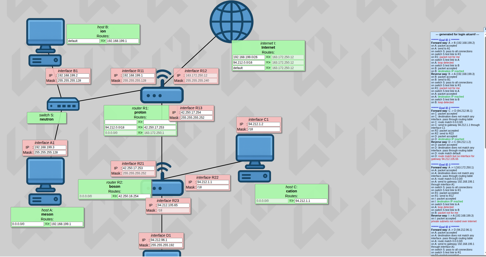  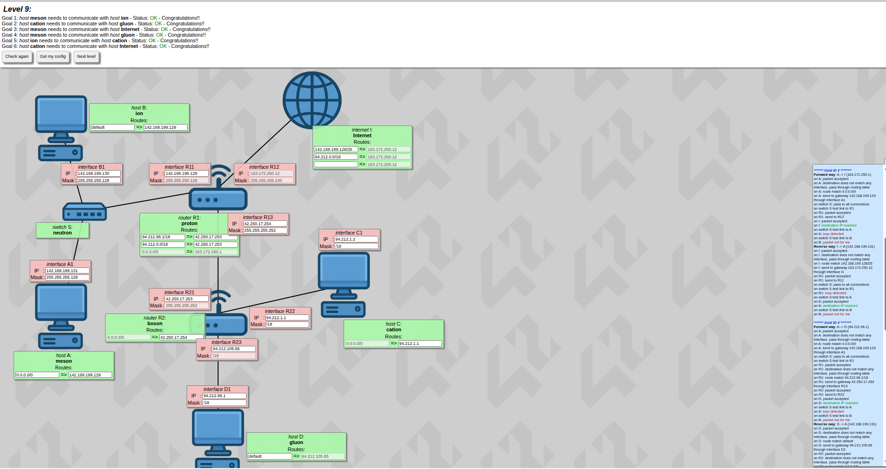

# Level 9 – Summary

This level consolidates most of the routing concepts seen so far.

## Network Topology
There are **5 networks** in total:

1. **LAN 1**  
   Two hosts (ION and MESON) are connected through a switch to router **R1**.  
   - The subnet mask is given on the router interface and must be used for all LAN devices.  
   - Each host configures a **default gateway** pointing to router interface **R11**.

2. **WAN to Internet**  
   Router **R1** connects directly to Internet through interface **R12**.  
   - IP address and mask are already provided.  
   - This interface is used for all unknown (default) traffic.

3. **WAN between routers**  
   Router **R1 (R13)** connects to **Router R2 (R21)**.  
   - This is a **WAN link**.  
   - Both interfaces (**R13 and R21**) must be in the **same subnet**.  
   - The subnet mask given on **R21** is reused on **R13**.

4. **LAN 2**  
   Router **R2** connects to host **CATION**.  
   - The subnet mask is given and must be used for all devices in this LAN.

5. **LAN 3**  
   Router **R2** connects to host **GLUON**.  
   - IP address and mask can be freely chosen.

## Routing Tables (Key Concept)

### Hosts
- All hosts use a **default route** pointing to their directly connected router interface.

### Router R2
- Routes **all default traffic** to its **next hop**, which is **Router R1**.

### Router R1 (Critical)
Router R1 has **two types of routes**:
1. **Default route** → Interface **R12** (Internet)
2. **Specific routes** → Traffic destined for **CATION and GLUON networks** is sent to **next hop R21**

### Internet
- Internet routes all traffic destined to **LAN 1 (ION and MESON)** through **R12**, ensuring bidirectional communication.

## Core Idea
The key point of this level is understanding how:
- WAN links between routers must share the same subnet
- Routers use **default routes + specific routes**
- Bidirectional communication requires correct routing on **both routers and Internet**
</details>

<details>
<summary>Level 10</summary>

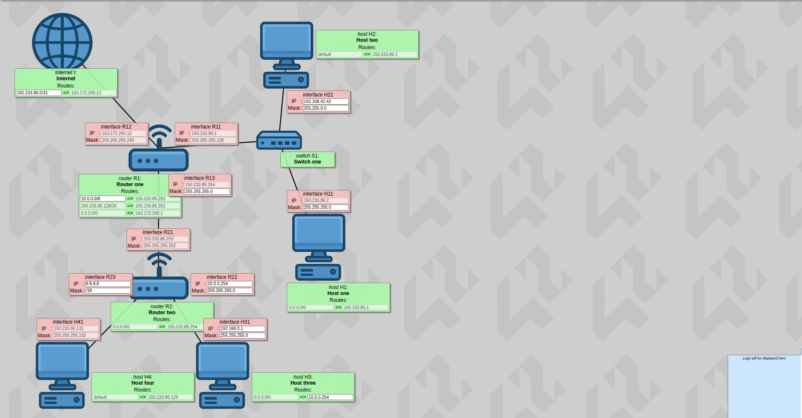  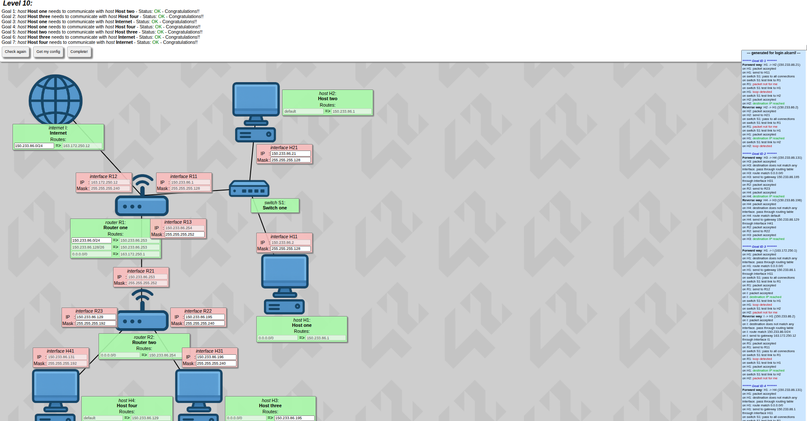

# Level 10 — Multi-Subnet Routing over a Single Major Network (Corrected)

## Overview
This level focuses on **subnetting a single major network into 5 non-overlapping subnets** and configuring routing so that **all LANs and Internet can communicate** through two routers.  
The critical aspects are **correct address allocation**, **WAN separation**, and **routing tables on Router R1 and R2**.

---

## Major Network
- **Base network:** 150.233.186.0/24  
- All five networks are **subnets of this same /24**

---

## Network 1 — Internet ↔ Router R1 (WAN)
- **Type:** WAN
- Connects **Internet** to **Router R1**
- IP and mask are **given by default**
- Internet routes traffic destined to internal networks via **Router R1**

---

## Network 2 — LAN 1 (Router R1 ↔ Hosts)
- **Interface:** R11
- **Type:** LAN
- IP and mask are given on R11
- Subnet range:
  - **150.233.186.1 – 150.233.186.127**
- Hosts:
  - Share the same subnet mask
  - Use **R11 as default gateway**

---

## Network 3 — WAN (Router R1 ↔ Router R2)
- **Interfaces:** R13 (R1) ↔ R21 (R2)
- **Type:** WAN
- **Subnet range:**  
  - **150.233.186.253 – 150.233.186.254**
- This subnet:
  - Is used **only to interconnect the routers**
  - Must be the **same on both interfaces**
  - Typically uses a **/30 mask**

---

## Network 4 — LAN 2 (Router R2 ↔ Host)
- **Interface:** R23
- **Type:** LAN
- **Subnet range:**  
  - **150.233.186.198 – 150.233.186.194**  
  *(small dedicated LAN, mask adjusted accordingly)*
- Host uses **R23 as default gateway**

---

## Network 5 — LAN 3 (Router R2 ↔ Host)
- **Interface:** R22
- **Type:** LAN
- **Remaining address space**
- **Subnet range:**  
  - **150.233.186.196 – 150.233.186.252**
- Mask chosen to:
  - Avoid overlap
  - Cover all remaining usable addresses
- Host uses **R22 as default gateway**

---

## Routing Logic — Router R1
- **Default route:**
  - All unknown traffic → **R12 (Internet interface)**
- **Internal routing:**
  - Traffic destined to subnets behind **Router R2** → **R13**
- Routes can be configured as:
  - Specific routes for R22 and R23 subnets
  - Or a broader route covering the internal address space toward **R21**

---

## Routing Logic — Router R2
- **Default route:**
  - All traffic → **R21 (towards Router R1)**
- Directly connected routes:
  - LAN via **R22**
  - LAN via **R23**
  - WAN via **R21**

---

## Key Takeaways
- All subnets are carved from **one /24 network**
- The **router-to-router link** uses the **highest addresses (.253–.254)**
- R23 uses a **small, fixed LAN range**
- R22 consumes **all remaining addresses**
- Correct routing requires:
  - Default routes outward
  - Explicit routes toward internal subnets via the WAN

</details>

## Resources ℹ️

<a href="https://broken-snowdrop-f03.notion.site/Modelo-OSI-2beb80eb3d88805b8b49d628f2e7cfe1?source=copy_link">
  
</a>  

Self-created Notion page explaining the **OSI model layer by layer**, with exercises and **backend configuration for LINUX**.


<a href="https://broken-snowdrop-f03.notion.site/Redes-y-protocolos-de-comunicacion-2beb80eb3d88806d83f0ccc5546b77fa?source=copy_link">
  
</a>  

Self-created Notion page with info about **Networks and Communication Protocols**.


<a href="https://www.youtube.com/playlist?list=PLbcS-eIZbbxWSCANJXiXj_5zBriR81m54">
  
</a>  

Curated **YouTube playlist** covering networking concepts.

## Author 🧑🏼‍💻

**alcarril**  
42 Network Curriculum Project

