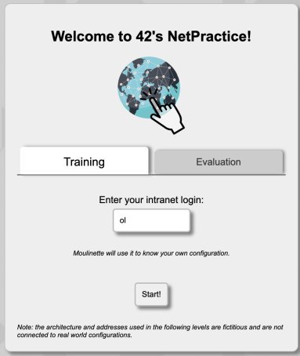

# Netpractice 🌐

## Overview

Netpractice is a networking project from the 42 curriculum focused on understanding **IP addressing and routing fundamentals**. The project consists of solving a set of interactive exercises where the user must correctly configure network devices so that communication between hosts is possible.

The main goal is to develop a solid understanding of how devices communicate at **OSI layers 1, 2, and 3**, with emphasis on IPv4 addressing, subnet masks, routing tables, and default gateways.

---

## Requirements

* Linux or macOS
* A modern web browser (Firefox, Chromium, Chrome, etc.)
* `tar` utility

---

## Installation

Extract the project archive provided in the repository.

**From the CLI:**

```bash
tar -xvf netpractice.tgz
```

**From the graphical environment:**

Double-click the `.tgz` file to extract it.

---

## Usage

After extracting the files, open the interface using a web browser.

**From the CLI:**

```bash
firefox index.html
```

*(Any modern browser can be used.)*

**From the graphical environment:**

Right-click on `index.html` → **Open with** → select your browser.

### Modes of Operation

Once opened, the Netpractice interface will load. There are two modes available:



#### Training Mode

Training mode allows practice using a **personalized configuration** associated with the user login.

* Contains **10 levels** with increasing difficulty.
* Each level presents a **network topology diagram** with missing fields.
* The user must configure:

  * IPv4 addresses
  * Subnet masks
  * Default gateways
  * Routing tables

The objective is to ensure correct communication between all devices according to the given topology.


After completing a level:

* **Check again** validates the configuration.
* **Get my config** exports the configuration as a **JSON file**.
* Successfully validating a level unlocks the **next level**.


At the bottom of the interface, **packet flow logs** display how IP packets traverse the network. These logs are essential for debugging issues such as:

* Incorrect or missing default gateways
* Invalid IP addresses
* Wrong subnet masks


#### Evaluation Mode

Evaluation mode generates a **randomized network configuration**, intended for assessments.

* Exercises are selected randomly.
* Focuses mainly on **levels 6 and above**, where routing complexity increases.

---

## TCP/IP Concepts Covered

The project relies on the following networking concepts:

* Computer networks fundamentals
* OSI model (layers 1–3)
* Communication protocols
* IPv4 protocol:

  * IP addressing structure
  * Subnet masks
  * Network and broadcast addresses
  * Routing tables
  * Subnetting
  * Default gateway

---

## Levels

<details>
<summary>Level 1</summary>
Description and objectives for Level 1.
</details>

<details>
<summary>Level 2</summary>
Description and objectives for Level 2.
</details>

<details>
<summary>Level 3</summary>
Description and objectives for Level 3.
</details>

<details>
<summary>Level 4</summary>
Description and objectives for Level 4.
</details>

<details>
<summary>Level 5</summary>
Description and objectives for Level 5.
</details>

<details>
<summary>Level 6</summary>
Description and objectives for Level 6.
</details>

<details>
<summary>Level 7</summary>
Description and objectives for Level 7.
</details>

<details>
<summary>Level 8</summary>
Description and objectives for Level 8.
</details>

<details>
<summary>Level 9</summary>
Description and objectives for Level 9.
</details>

<details>
<summary>Level 10</summary>
Description and objectives for Level 10.
</details>

---
## Resources

* OSI Model documentation
* IPv4 addressing and subnetting guides
* Routing and networking fundamentals

---

## Author

**alcarril**  
42 Network Curriculum Project

